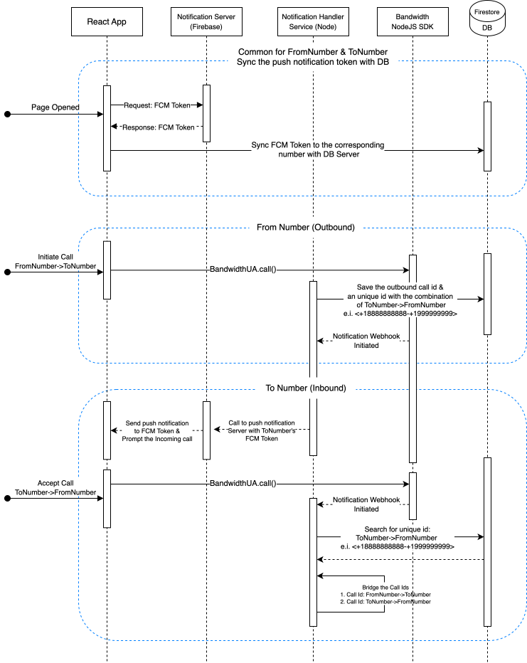

# In-App Calling Dialpad

# Table of Contents

- [Description](#description)
- [Pre-Requisites](#pre-requisites)
- [Initialization](#initialization)
- [Running the Application](#running-the-application)

# Description

A self-contained dial pad app that exercises the Bandwidth WebRTC SDK against the new BRTC platform. Runs two processes from a single `npm start`:

- **Express backend** (`server/`) — registers the endpoint event callback, handles `outboundConnectionRequest`, places PSTN legs via the Voice API, and returns `<Connect><Endpoint>` BXML to bridge. Listens on `PORT` (default 3000).
- **React dev server** (`src/`) — serves the UI on port 3001. `src/setupProxy.js` mints short-lived OAuth access tokens at `GET /token` and same-origin-proxies the BW REST API at `/bwapi` so the SDK's endpoint creation doesn't hit a browser CORS preflight.

Inbound Bandwidth callbacks reach the backend via a public tunnel you provide (`CALLBACK_BASE_URL`, typically ngrok or cloudflared → `http://localhost:3000`).

# Pre-Requisites

Your account must have In-App Calling enabled. For API credentials, see [Account Credentials](https://dev.bandwidth.com/docs/account/credentials).

You need an OAuth2 client ID and secret. The dev server mints short-lived access tokens on demand (see `src/setupProxy.js`), so the browser never sees the client secret and no long-lived token is baked into the bundle.

You also need a publicly reachable URL forwarding to `http://localhost:3000` (ngrok, cloudflared, or equivalent) and a Bandwidth Voice application whose `CallInitiatedCallbackUrl` points at `<public-url>/callbacks/bandwidth`. You can update that with the [band CLI](https://github.com/Bandwidth/bw-cli):

```sh
band app update <app-id> --callback-url https://<your-tunnel>/callbacks/bandwidth
```

### Environment Setup

1. Copy the example environment file:

```sh
cp .env.example .env
```

2. Fill in your values in `.env`:

```sh
# Client-visible (React) — baked into the bundle
REACT_APP_ACCOUNT_ID=              # Your Bandwidth account ID
REACT_APP_ACCOUNT_USERNAME=        # Source phone number (e.g. +15551234567)
REACT_APP_EVENT_CALLBACK_URL=      # <CALLBACK_BASE_URL>/callbacks/bandwidth

# Server-side (Express backend in ./server)
BW_ID_CLIENT_ID=                   # Bandwidth OAuth2 client ID
BW_ID_CLIENT_SECRET=               # Bandwidth OAuth2 client secret
ACCOUNT_ID=                        # Same as REACT_APP_ACCOUNT_ID, for the backend
APPLICATION_ID=                    # Voice application that owns FROM_NUMBER
FROM_NUMBER=                       # PSTN number the backend originates from
CALLBACK_BASE_URL=                 # Public tunnel base URL (e.g. https://xyz.trycloudflare.com)
```

Optional overrides (uncomment in `.env` if needed):

```sh
# REACT_APP_GATEWAY_URL=           # Override the WebRTC gateway WebSocket URL
# REACT_APP_HTTP_BASE_URL=         # Override REST base URL (defaults to /bwapi proxy)
# HTTP_BASE_URL=                   # Full BW REST URL incl. /v2 (default https://api.bandwidth.com/v2)
# BW_ID_HOSTNAME=                  # Override the Identity host (default https://api.bandwidth.com)
# VOICE_URL=                       # Override the Voice API URL (default https://voice.bandwidth.com/api/v2)
# PORT=                            # Backend port (default 3000)
```

# Initialization

- **BandwidthUA**: The instance is available from the outset. Initialization is required before making a call. Follow the below code snippet for initialization:

```js
import { BandwidthUA } from "@bandwidth/bw-webrtc-sdk";

const phone = new BandwidthUA({
  accountId: accountId,
});

phone.checkAvailableDevices();
phone.setAccount(`${sourceNumber}`, "In-App Calling Sample", "");

// Fetch a short-lived access token from the dev server's /token endpoint
// (backed by setupProxy.js — client credentials stay server-side).
const { access_token } = await (await fetch("/token")).json();
phone.setOAuthToken(access_token);

await phone.init();
```

> **Note:** In v1.2.0, `setServerConfig()` is no longer required. The SDK connects directly to the Bandwidth WebRTC backend. The only new requirement is passing `accountId` in the constructor. See the [SDK README](https://github.com/Bandwidth/javascript-webrtc-sdk#migration-from-v11x) for migration details.

# Usage

### Making a Call

Making a call using the Bandwidth services involves a series of steps to ensure the call's proper initiation and management.

```js
const activeCall = await phone.makeCall(`${destNumber}`, extraHeaders);
```

Keep the `activeCall` instance in persistent state in order to reuse this instance for call termination, hold & mute.

### Terminating a Call

```js
activeCall.terminate();
```

This method is responsible for correctly signaling the termination of the call session. After invoking this method, it's a good practice to handle UI transitions and take any other post-call actions that may be necessary in your application's context.

### Listeners and Implementation

Listeners are pivotal in monitoring and responding to real-time events during the call.

In the provided code, the `BandwidthUA.setListeners` is used. This listener has multiple callback methods.

**Implementation**:

To use the listener, you implement it as an anonymous class and provide logic inside each method:

```js
phone.setListeners({
  loginStateChanged: function (isLogin, cause) {
    console.log(cause);
    switch (cause) {
      case "connected":
        console.log("phone>>> loginStateChanged: connected");
        break;
      case "disconnected":
        console.log("phone>>> loginStateChanged: disconnected");
        break;
      case "login failed":
        console.log("phone>>> loginStateChanged: login failed");
        break;
      case "login":
        console.log("phone>>> loginStateChanged: login");
        break;
      case "logout":
        console.log("phone>>> loginStateChanged: logout");
        break;
    }
  },

  outgoingCallProgress: function (call, response) {
    console.log("phone>>> outgoing call progress");
  },

  callTerminated: function (call, message, cause) {
    console.log(`phone>>> call terminated callback, cause=${cause}`);
  },

  callConfirmed: function (call, message, cause) {
    console.log("phone>>> callConfirmed");
  },

  callShowStreams: function (call, localStream, remoteStream) {
    console.log("phone>>> callShowStreams");
    let remoteVideo = document.getElementById("remote-video-container");
    if (remoteVideo != undefined) {
      remoteVideo.srcObject = remoteStream;
    }
  },

  incomingCall: function (call, invite) {
    console.log("phone>>> incomingCall");
  },

  callHoldStateChanged: function (call, isHold, isRemote) {
    console.log(
      `phone>>> callHoldStateChanged to ${isHold ? "hold" : "unhold"}`
    );
  },
});
```

### Configuring Inbound Calls

- **Overview:** We have used two major capabilities to make the inbound call

  - Caller to Callee & Callback from Callee to Caller
  - Bridging the both calls to connect caller and callee in a single call

- **Sequence Diagram:** Follow sequence diagram to implement the in call using the SDK
  

- **Notification Handler Service Sample:**
  https://github.com/Bandwidth-Samples/in-app-calling-inbound-demo

# Running the Application

`npm start` runs both the backend and the React dev server concurrently:

```sh
npm install
npm start
# → Express backend on http://localhost:3000
# → React dev server on http://localhost:3001 (CRA defaults to 3001 when 3000 is taken)
```

You also need a tunnel forwarding `https://<your-public-url>` → `http://localhost:3000`, e.g.:

```sh
cloudflared tunnel --url http://localhost:3000
# or: ngrok http 3000
```

Put the resulting URL into `CALLBACK_BASE_URL` and `REACT_APP_EVENT_CALLBACK_URL` (append `/callbacks/bandwidth` for the latter), and keep the Voice application's callback URL in sync via `band app update`.

# Error Handling

Errors, especially in networked operations, are inevitable. Ensure you catch, manage, and inform users about these, fostering a seamless experience.
